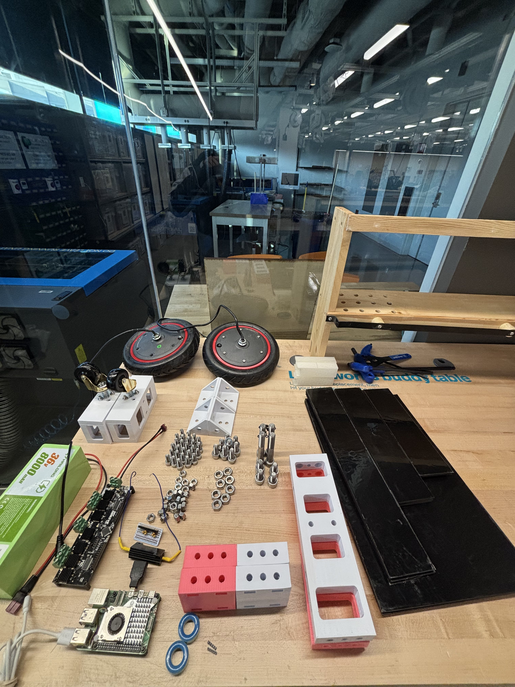

Build Guide
===========

Introduction
------------

This page walks you through assembling the robot step by step. It also provides an overview of the necessary tools, materials, and prerequisites.

Mechanical Assembly
-------------------

#. **Print or Laser-Cut Parts**: Instructions on how to obtain the mechanical parts.
#. **Gather Fasteners**: List of required screws, nuts, washers, etc.

#. **Parts List**:
   - 3D print all the necessary parts. It is recommended to use ASA or ABS with 80% infill and at least 8 walls to increase strength.
   - Laser-cut all the provided DXF files using either acrylic or MDF. Non-structural plates, such as the bottom plate, can be cut from plywood.

#. **Building Steps**:

   #. **Step 1**:
      Gather the main brackets and bolts.

   .. image:: _images/IMG_1806.jpg
      :alt: Assembly Step 2
      :width: 300px

   #. **Step 2**:
      Assemble the main brackets and bolts.

   .. image:: _images/IMG_1808.jpg
      :alt: Assembly Step 2
      :width: 150px

   #. **Step 3**:
      Attach the two longer boards to the main brackets using eight M8x20 bolts. The bolts will be loose for now, which is fine.

   .. image:: _images/IMG_1811.jpg
      :alt: Assembly Step 2
      :width: 300px

   #. **Step 4**:
      Insert the M8 nuts into the holes in the spacers. Tighten all eight M8x20 bolts using an Allen key with a rounded head.

   .. image:: _images/IMG_1814.jpg
      :alt: Assembly Step 2
      :width: 300px

   #. **Step 5**:
      Get the angled brackets and attach them to the main frame using M8x20 bolts.

   .. image:: _images/IMG_1817.jpg
      :alt: Assembly Step 2
      :width: 300px

   #. **Step 6**:
      Get the two front panels and four M8x20 bolts and nuts. Attach the front and back panels as shown.

   .. image:: _images/IMG_1824.jpg
      :alt: Assembly Step 2
      :width: 300px

   #. **Step 7**:
      Get the M10x20 bolts and attach them through the bottom holes on the angled brackets. Refer to the pictures for details. Use a long Allen key to tighten the bolts.

   .. image:: _images/IMG_1832.jpg
      :alt: Assembly Step 2
      :width: 300px

   #. **Step 8**:
      Attach the bottom plate (the one with holes for the electronics) to the angled brackets using M10 bolts and nuts. Use M12x10 bolts to reinforce the attachment to the main bracket.

   .. image:: _images/IMG_1837.jpg
      :alt: Assembly Step 2
      :width: 300px

   #. **Step 9**:
      Place the robot on its side as shown in the picture. This is how it should look.

   .. image:: _images/IMG_1841.jpg
      :alt: Assembly Step 2
      :width: 300px

   #. **Step 10**:
      Attach the main board (Raspberry Pi 5) using M3 standoffs, nuts, and nylon bolts.

   .. image:: _images/IMG_1843.jpg
      :alt: Assembly Step 2
      :width: 300px

   #. **Step 11**:
      Install the scooter motor. Carefully insert the wires into the hole on the side bracket and tighten the main bolt into the panel.
      Ensure that no orthogonal force is applied to the axis, as this may stress the panels. Instead, rotate the bolt while keeping the motor upright to tighten it.

   .. image:: _images/IMG_1847.jpg
      :alt: Assembly Step 2
      :width: 300px

   #. **Step 12**:
      Use a nut to secure the motor bolt. Apply a small amount of Loctite to prevent it from loosening due to vibrations.

   .. image:: _images/IMG_1848.jpg
      :alt: Assembly Step 2
      :width: 300px

   #. **Step 13**:
      Get the outer panel and tighten the motor’s nut and bolt. Also, secure it to the spacers using four M8x20 bolts and nuts.

   .. image:: _images/IMG_1850.jpg
      :alt: Assembly Step 2
      :width: 300px

   #. **Step 14**:
      Repeat the previous steps to attach the second motor to the other side. Manage the wiring accordingly. You can trim the wires if this is the final setup for the motors.

   .. image:: _images/IMG_1860.jpg
      :alt: Assembly Step 2
      :width: 300px

   #. **Step 15**:
      Insert the caster wheel holders. Ensure that the springs are installed and that the suspension system functions correctly before final assembly.

   .. image:: _images/IMG_1865.jpg
      :alt: Assembly Step 2
      :width: 300px

   #. **Step 16**:
      Secure the caster wheel holders using an M8 bolt and M8 grub nut. These bolts will later be used to attach the depth camera.

   .. image:: _images/IMG_1869.jpg
      :alt: Assembly Step 2
      :width: 300px

   #. **Step 17**:
      Install the ODrive controller using M3 standoffs and nuts.

      - Prepare the wires by adding toroid cores at the end of the power wires for the motor.
      - Add male pin connectors to the signal wires.
      - The format should be: **+ A B C -**, where:
        - Red = Positive
        - Black = Negative
        - Green, Blue, Yellow = Motor phase wires (order may vary).

   .. image:: _images/IMG_1874.jpg
      :alt: Assembly Step 2
      :width: 300px

   #. **Step 18** (Optional):
      Add 44nF capacitors between ground and all control signals on the ODrive.
      Connect the encoder wires to the ODrive and add a power resistor (2Ω, 50W) between the power input and ground.

   .. image:: _images/IMG_1878.jpg
      :alt: Assembly Step 2
      :width: 300px

   #. **Step 19**:
      Place the main battery in the remaining space. 

      - For the demonstration, the largest battery that fits is used.
      - Any battery above **24V and 3Ah** should be sufficient.
      - Use a **DC-DC converter** with a USB-C output to power the Raspberry Pi.
      - Connect the ODrive to the Raspberry Pi via USB.
      - Add a power switch between the battery, ODrive, and DC-DC regulator.
      - Route the battery’s charging cable to the top plate for easy access.

   .. image:: _images/IMG_1881.jpg
      :alt: Assembly Step 2
      :width: 300px

   #. **Step 20**:
      Secure the top plate using M10 nuts. If carrying a payload, use M12 bolts of any length (M12x70 bolts are used in the demo).

   .. image:: _images/IMG_1884.jpg
      :alt: Assembly Step 2
      :width: 300px

   #. **Step 21**:
      Place the robot on a stand for initial testing and calibration.

   .. image:: _images/IMG_1885.jpg
      :alt: Assembly Step 2
      :width: 300px

Testing
-------

Once assembled, perform a quick check to ensure that all components move freely. Refer to the software setup guide to fully test the robot. Mechanical assembly is now complete.
