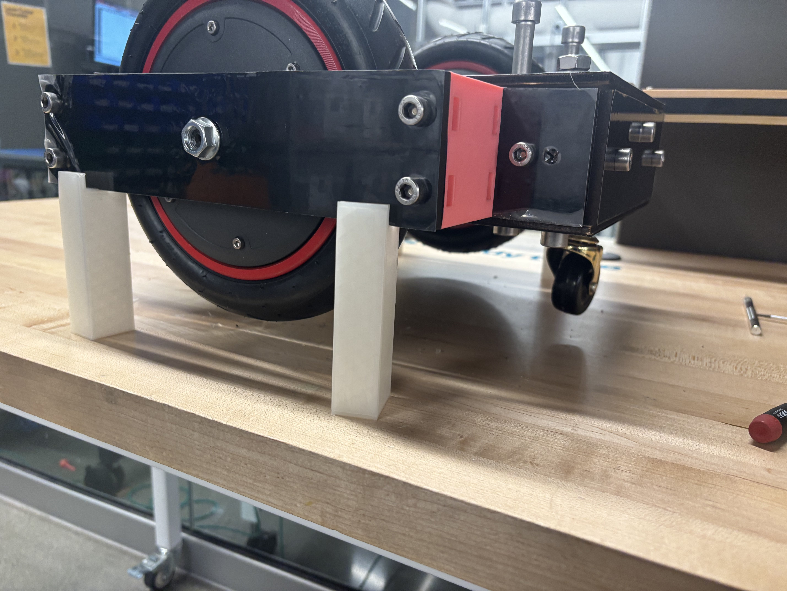

.. MyRobotPupper documentation master file
   You can add a license, copyright, etc.

Welcome to Unibot Documentation!
=========================================

Introduction
------------

Unibot is an open source wheeled robot base with a emphasis on usability and simplicty. The main goal of this project is to make
it easier for all to conduct eveperiments and test out new algorithms and develop new technologies on a standardized base.  

.. toctree::
   :maxdepth: 2
   :caption: Contents:

   build_guide
   mechanical_design
   software_support
   bluetooth_setup

Indices and tables
------------------

* :ref:`genindex`
* :ref:`modindex`
* :ref:`search`
