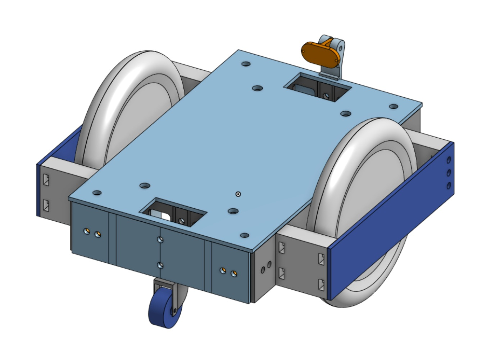

Mechanical Design
=================

CAD Files
---------

Link to the step files. 
**Example**:
`Download CAD Files ../_assets/assembly.zip <../_assets/assembly.zip>`_

Exploded Views
--------------

Discuss any important design features or constraints.

Materials & Dimensions
----------------------

- Frame Material: 
- Bracket Thickness: 
- Dimensions: 
